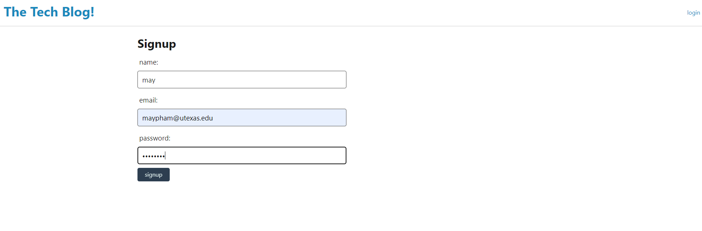

# Model-View-Controller-Tech-Blog
UT's Fullstack Flex Web Development Bootcamp - Challenge 14

## Description
This assignment is created for developers to write blogs about tech and programming. Blog uses CMS style for users to publish blog posts, articles, and etc. Packages used are sequelize, express, handlebars, mysql2. etc. The code utilizes MVC structure and implements js, css styling, etc.

## Usage

https://github.com/mayphamx/Model-View-Controller-Tech-Blog

https://guarded-dawn-23914-1e7dfc9bf60a.herokuapp.com/